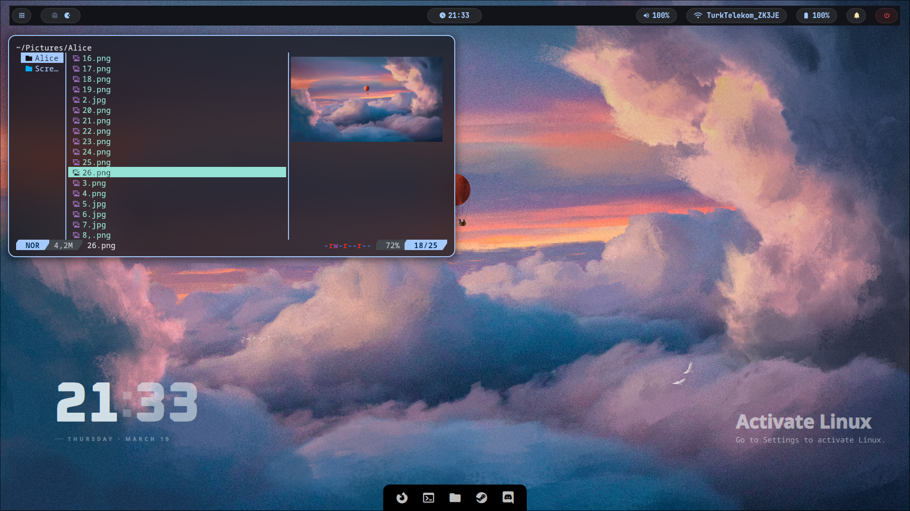
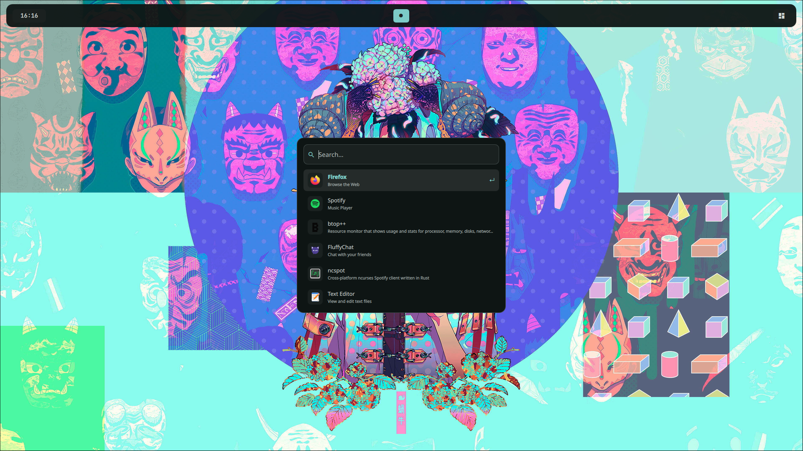

# 💧 vroomies

*a hyprland dotfiles setup — fast, minimal, opinionated*

 

---

## ✦ showcase

<b>📸 more screenshots</b>

 

| wallpaper switcher | app launcher |
|---|---|
|  |  |

---

## ✦ stack

| category | tool |
|---|---|
| 🐧 **OS** | [CachyOS](https://cachyos.org/) |
| 🪟 **Compositor** | [Hyprland](https://github.com/hyprwm/Hyprland) |
| 🖥️ **Terminal** | [Kitty](https://github.com/kovidgoyal/kitty) |
| 🎵 **Music** | [Spotify](https://open.spotify.com/) |
| 🐚 **Shell** | [Zsh](https://github.com/zsh-users/zsh) |
| 📊 **Bar + Launcher** | [Quickshell](https://quickshell.org/) |
| ✏️ **Editor** | [Neovim](https://github.com/neovim/neovim) |
| 📁 **Files** | [yazi](https://github.com/sxyazi/yazi) and [Dolphin|(https://apps.kde.org/dolphin)

---

## ✦ keybinds

> `SUPER` is your modifier key

| action | keybind | description |
|---|---|---|
| **Terminal** | `SUPER + RETURN` | Launch Kitty |
| **File Manager** | `SUPER + SHIFT + RETURN` | Launch dolphin |
| **Floating Window** | `SUPER + F` | Toggle floating mode |
| **Browser** | `SUPER + W` | Open default browser |
| **App Launcher** | `SUPER + D` | Open app menu |
| **Wallpaper Picker** | `SUPER + SHIFT + A` | Run wallpaper selector |

---

## ✦ star history

  <a href="https://www.star-history.com/?repos=maxchennn/vroomies&type=date&legend=top-left">
    <picture>
      <source media="(prefers-color-scheme: dark)" srcset="https://api.star-history.com/image?repos=maxchennn/vroomies&type=date&theme=dark&legend=top-left" />
      <source media="(prefers-color-scheme: light)" srcset="https://api.star-history.com/image?repos=maxchennn/vroomies&type=date&legend=top-left" />
      
    </picture>
  </a>

---

## ✦ credits

thanks to the [r/hyprland](https://www.reddit.com/r/hyprland/) and [r/QuickShell](https://www.reddit.com/r/QuickShell/) communities for inspiration 💙

 

*made with 💧 by maxchennn*

